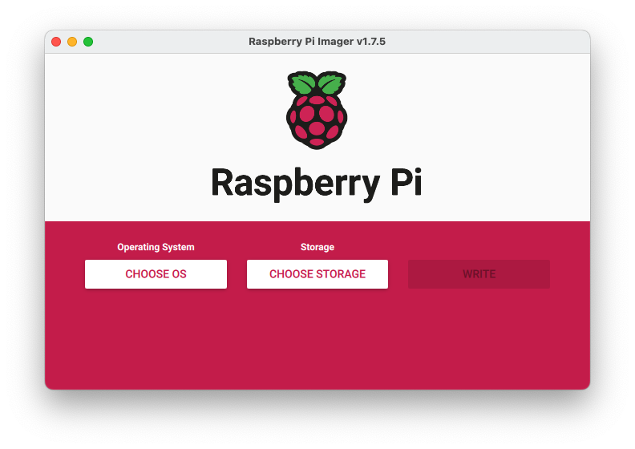
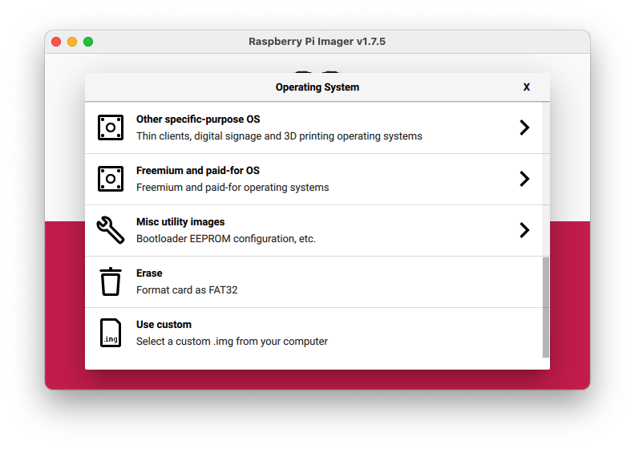
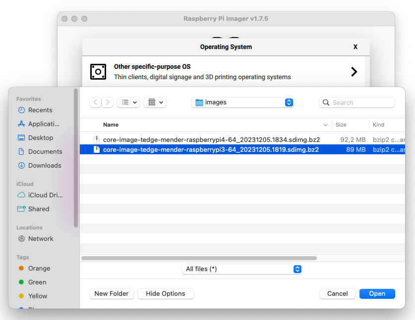
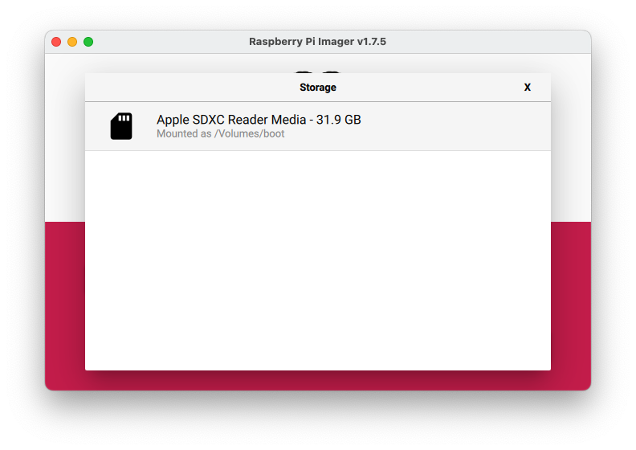
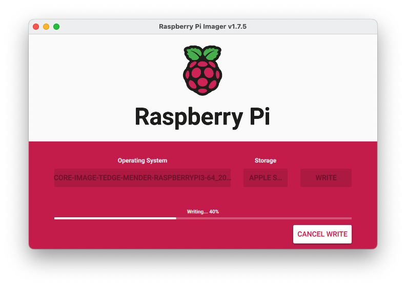
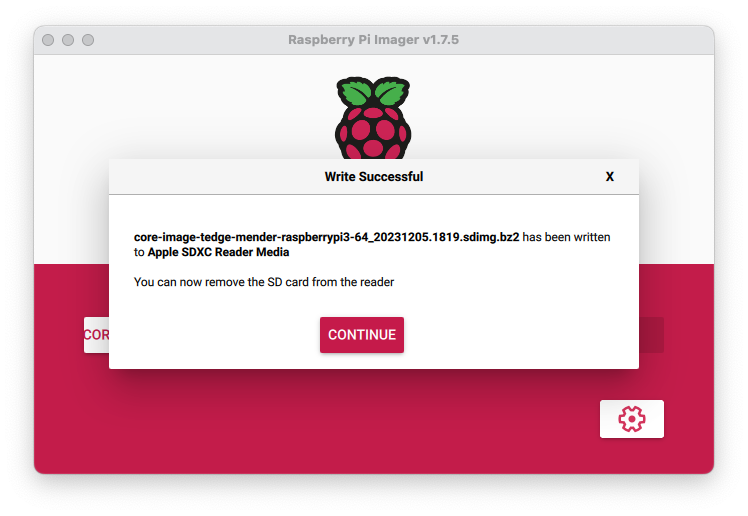

## Flashing an image using Raspberry Pi Imager

The [Raspberry Pi Imager](https://www.raspberrypi.com/software/) software can also be used to flash either official Raspberry Pi Operating System version or custom built images to an SD Card. You can use this for both Raspberry PI and non-Raspberry Pi devices.

### Pre-requisites

To following these instructions you will need to have the following software installed:

* [Raspberry Pi Imager](https://www.raspberrypi.com/software/)
* A custom built image

### Procedure

1. Open up the [Raspberry Pi Imager](https://www.raspberrypi.com/software/)

    

2. Select the **Use custom** option

    

3. Browser to the `*.sdimg.bz2` image that you wish to use

    

    :::tip
    You may need to change the file filter to use teh "All Files" option if you intended image file is not selectable in the select file dialog.
    :::

3. Choose the storage where the image will be written to

    

4. Select **Write** and if prompted don't include any customization settings

    

    :::caution
    You can not use any Raspberry Pi Imager customization settings, as the Yocto image does not know what do with the settings, plus everything you need should be included in the image (even initial Wifi credentials). But if you use an ethernet connection, then you don't need to worry about Wifi credentials until you have bootstrapped the device.
    :::

5. Wait for the image to be completed

    
