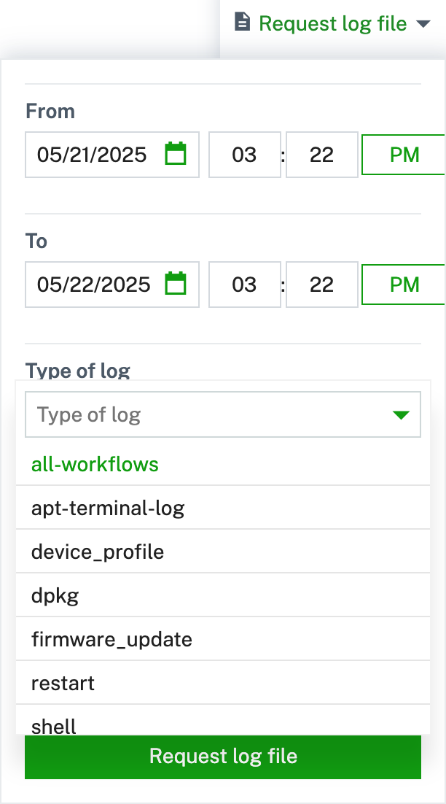

# How to retrieve logs with the log plugin

You can now access any type of logs directly from your Cumulocity UI, using the
`tedge-log-plugin` daemon. To get started install the `tedge-log-plugin` via the
debian package.

If you have not installed via the debian package, make sure you have the following:

- a `tedge-log-plugin.service` file in `/lib/systemd/system/tedge-log-plugin.service`
- a `tedge-log-plugin` binary in `/usr/bin/`
- check if `/etc/tedge/plugins/tedge-log-plugin.toml` was created

After the device is connected to Cumulocity, this plugin needs to be started and
enabled as follows:

```sh
sudo systemctl enable tedge-log-plugin
sudo systemctl start tedge-log-plugin
```

If you go to Cumulocity, you should see that you are able to see the logs tab
and you can request "software-management" logs.
However, you are not limited to only thin-edge logs.
To add a new log type, you need to edit the `tedge-log-plugin.toml` in `/etc/tedge/plugins/tedge-log-plugin.toml`

```sh
sudo nano /etc/tedge/plugins/tedge-log-plugin.toml
```

In this toml file you specify the log type and log path of the logs wished to
be retrieved from Cumulocity UI.
For example, if you wish to request thin-edge software logs and mosquitto logs
an example toml file would be:

```toml title="file: /etc/tedge/plugins/tedge-log-plugin.toml"
files = [
  { type = "software-management", path = "/var/log/tedge/agent/software-*" },
  { type = "mosquitto", path = "/var/log/mosquitto/mosquitto.log" }
]
```

Note that `path` need not be a complete path. It can be a full path to a log
file or a [glob pattern](https://en.wikipedia.org/wiki/Glob_(programming)).
For example the "software-management" type is a glob pattern that groups
any file inside "/var/log/tedge/agent/" that starts with "software-".

The `type` key in the toml is the name of the log with you will see in the
Cumulocity UI:



