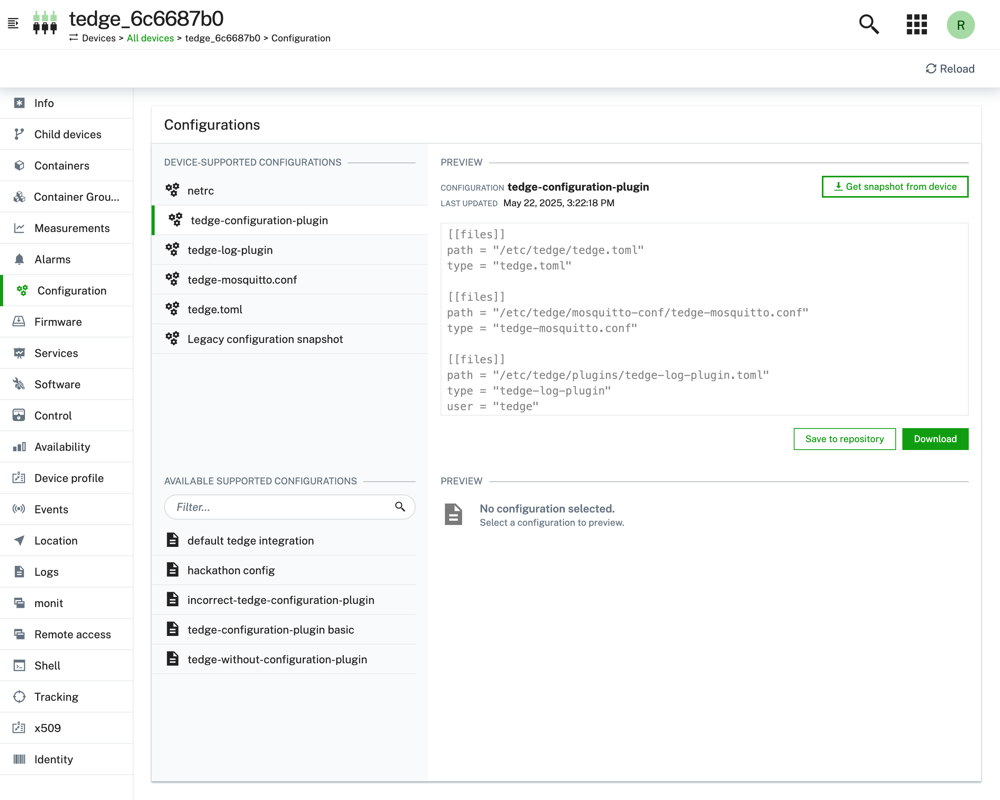
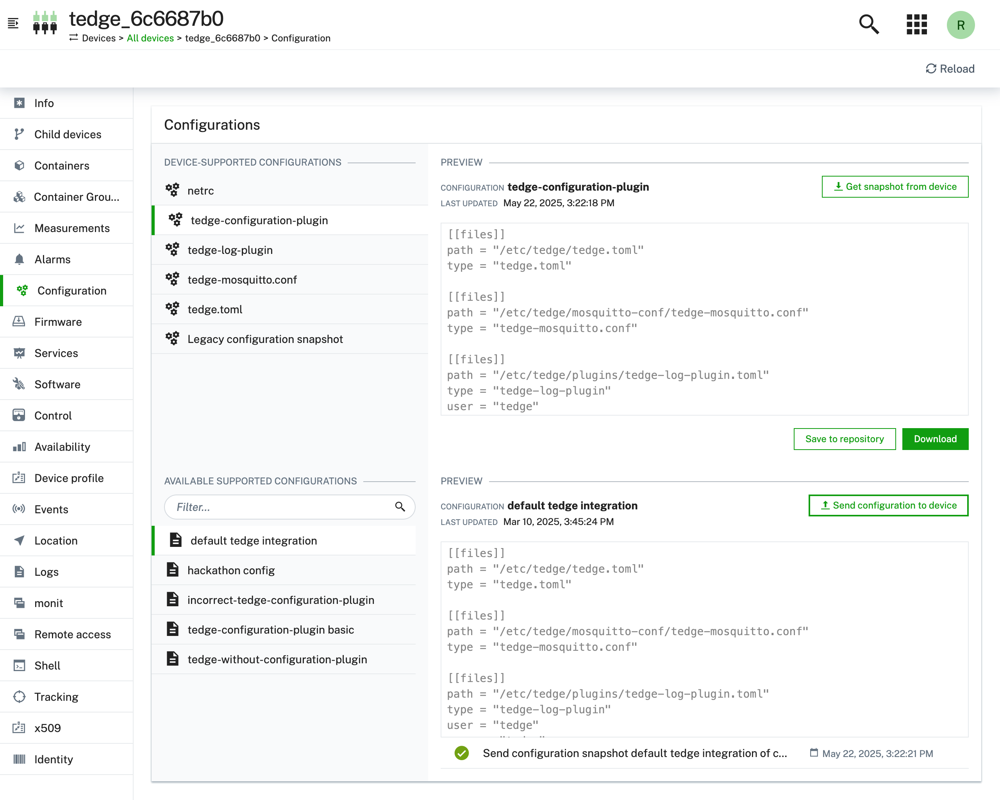

With `thin-edge.io`, you can manage config files on a device by using the [Cumulocity configuration management feature](https://cumulocity.com/guides/users-guide/device-management/#managing-configurations) as a part of Device Management.

If you are new to the Cumulocity **Configuration Management** feature,
we recommend you to read [the Cumulocity user guide](https://cumulocity.com/guides/users-guide/device-management/#managing-configurations) along with this how-to guide.

The configuration management functionality is provided by the **tedge-agent** service which is installed by default.

## Getting started

Before starting anything, make sure [your device is connected to Cumulocity](../../start/connect-c8y.md).

**Step 1**
Open the file `/etc/tedge/plugins/tedge-configuration-plugin.toml` and add entries for the configuration files that you'd like to manage from Cumulocity cloud in the following format:

```toml title="file: /etc/tedge/plugins/tedge-configuration-plugin.toml"
files = [
  { path = '/etc/tedge/tedge.toml', type = 'tedge.toml'},
  { path = '/etc/tedge/mosquitto-conf/c8y-bridge.conf', type = 'c8y-bridge.conf' },
  { path = '/etc/tedge/mosquitto-conf/tedge-mosquitto.conf', type = 'tedge-mosquitto.conf' },
  { path = '/etc/mosquitto/mosquitto.conf', type = 'mosquitto.conf' },
  { path = '/etc/tedge/c8y/example.txt', type = 'example', user = 'tedge', group = 'tedge', mode = 0o444 }
]
```

* `path` is the full path to the configuration file.
* `type` is a unique alias for each file entry which will be used to represent that file in Cumulocity UI.
* `user`, `group` and `mode` are UNIX file permission settings to be used to create a configuration file. If not provided, the files will be created with `root` user. If the file exists already, its ownership will be retained.

For more details on this configuration file format, refer to the [reference guide](../../references/agent/tedge-configuration-management.md#configuration).

:::note
You can also configure the `tedge-configuration-plugin.toml` from the cloud later.
:::

**Step 2**
Navigate to your Cumulocity Device Management and the desired device. Open its **Configuration** tab.
You can find `tedge-configuration-plugin` and more are listed as supported configuration types, as declared in the plugin configuration file in step 1.



This is the configuration file of `tedge-configuration-plugin`, where you can add file entries that you want to manage with Cumulocity.

## Update tedge-configuration-plugin configuration from Cumulocity

To update any configuration file, create a local copy of that config file and then upload that file to the [Cumulocity configuration repository](https://cumulocity.com/guides/users-guide/device-management/#to-add-a-configuration-snapshot) with the appropriate configuration type.

The `tedge-configuration-plugin.toml` file can also be updated from the cloud in a similar manner to add/remove further configuration file entries. The updated TOML file has to be uploaded with the configuration type:  **tedge-configuration-plugin**.

Then, go back to the **Configuration** tab of your desired device in Cumulocity.



Click on the config file entry from the **DEVICE SUPPORTED CONFIGURATIONS** files list.
You can choose the file that you uploaded from the **AVAILABLE SUPPORTED CONFIGURATIONS** section, and then apply that file to your device by clicking on the **Send configuration to device** button.

After the operation created gets marked SUCCESSFUL, reload the page.
Then you can find new supported configuration types as you defined.

To get to know more about the `tedge-configuration-plugin`, refer to [Specifications of Device Configuration Management using Cumulocity](../../references/agent/tedge-configuration-management.md).
