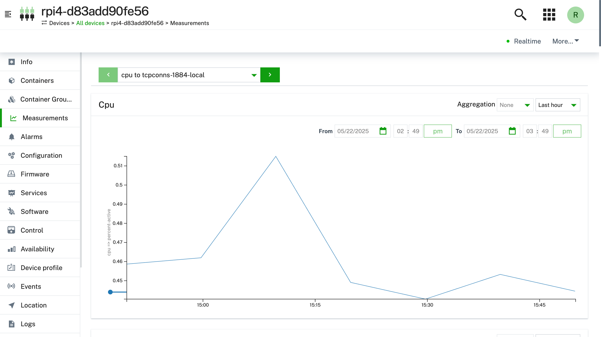

With %%te%% device monitoring, you can collect metrics from your device
and forward these device metrics to IoT platforms in the cloud.

Using these metrics, you can monitor the health of devices
and can proactively initiate actions in case the device seems to malfunction.
Additionally, the metrics can be used to help the customer troubleshoot when problems with the device are reported.

%%te%% uses the open source component [collectd](https://collectd.org/) to collect the metrics from the device.
%%te%% translates the collectd metrics from their native format to the [%%te%% JSON](../understand/thin-edge-json.md) format
and then into the [cloud-vendor specific format](../understand/tedge-mapper.md).



## Install

Device monitoring is not enabled by default, however it can be enabled using a community package, [tedge-collectd-setup](https://cloudsmith.io/~thinedge/repos/community/packages/?q=name%3A%27%5Etedge-collectd-setup%24%27), which will install [collectd](https://collectd.org/) and configure some sensible defaults including monitoring of cpu, memory and disk metrics.

```sh tab={"label":"Debian/Ubuntu"}
sudo apt-get install tedge-collectd-setup
```

```sh tab={"label":"RHEL/Fedora/RockyLinux"}
sudo dnf install tedge-collectd-setup
```

```sh tab={"label":"Alpine"}
sudo apk add tedge-collectd-setup
```

:::note
The default collectd settings, `/etc/collectd/collectd.conf`, use conservative interval times, e.g. 10 mins to 1 hour depending on the metric. This is done so that the metrics don't consume unnecessary IoT resources both on the device and in the cloud. If you want to push the metrics more frequently then you will have to adjust the `Interval` settings either globally or on the individual plugins. Make sure you restart the collectd service after making any changes to the configuration.
:::

## Background

The following sections provide information about further customizing the collectd settings and give some background about how the collectd messages are processed by the **tedge-mapper-collectd** service.

### collectd configuration {#collectd-configuration}

You can further customize the default collectd configuration by editing the following file:

```sh
/etc/collectd/collectd.conf
```

Details about collectd plugins and their configuration can be viewed directly from the [collectd documentation](https://collectd.org/documentation/manpages/collectd.conf.5.shtml).

However keep in mind the following points when editing the file:

1. __MQTT must be enabled__.
   * %%te%% expects the collectd metrics to be published on the local MQTT bus.
     Hence, you must enable the [MQTT write plugin of collectd](https://collectd.org/documentation/manpages/collectd.conf.5.shtml#plugin_mqtt).
   * The MQTT plugin is available on most distribution of `collectd`, but this is not the case on MacOS using homebrew.
     If you are missing the MQTT plugin, please recompile `collectd` to include the MQTT plugin.
     See [https://github.com/collectd/collectd](https://github.com/collectd/collectd) for details.
   * Here is a config snippet to configure the MQTT write plugin:

     ```xml
      LoadPlugin mqtt

      <Plugin mqtt>
          <Publish "tedge">
              Host "localhost"
              Port 1883
              ClientId "tedge-collectd"
          </Publish>
      </Plugin>
     ```
2. __RRDTool and CSV might be disabled__
   * The risk with these plugins is to run out of disk space on a small device.
   * With %%te%% the metrics collected by `collectd` are forwarded to the cloud,
     hence it makes sense to [disable Local storage](https://github.com/collectd/collectd/issues/2668).
   * For that, simply comment out these two plugins:

      ```sh
      #LoadPlugin rrdtool
      #LoadPlugin csv
      ```
3. __Cherry-pick the collected metrics__
   * `Collectd` can collect a lot of detailed metrics,
      and it doesn't always make sense to forward all these data to the cloud.
   * Here is a config snippet that uses the `match_regex` plugin to select the metrics of interest,
     filtering out every metric emitted by the memory plugin other than the used metric":

      ```xml
      PreCacheChain "PreCache"

      LoadPlugin match_regex

      <Chain "PreCache">
          <Rule "memory_free_only">
              <Match "regex">
                  Plugin "memory"
              </Match>
              <Match "regex">
                  TypeInstance "used"
                  Invert true
              </Match>
              Target "stop"
          </Rule>
      </Chain>
      ```

### tedge-mapper-collectd

The `tedge-mapper-collectd` service subscribes to the `collectd/#` topics to read the monitoring metrics published by collectd
and emits the translated measurements in %%te%% JSON format to the **measurements** topic.

The metrics collected by `collectd` are emitted to subtopics named after the collectd plugin and the metric name. You can inspect the collectd messages using the following commands:

```sh te2mqtt formats=v1
tedge mqtt sub 'collectd/#'
```

```log title="Output"
[collectd/raspberrypi/cpu/percent-active] 1623076679.154:0.50125313283208
[collectd/raspberrypi/memory/percent-used] 1623076679.159:1.10760866126707
[collectd/raspberrypi/cpu/percent-active] 1623076680.154:0
[collectd/raspberrypi/df-root/percent_bytes-used] 1623076680.158:71.3109359741211
[collectd/raspberrypi/memory/percent-used] 1623076680.159:1.10760866126707
```

The `tedge-mapper-collectd` translates these collectd measurements into the [%%te%% JSON](../understand/thin-edge-json.md) format,
[grouping the measurements](../references/mappers/mqtt-topics.md#collectd-topics) emitted by each plugin:

```sh te2mqtt formats=v1
tedge mqtt sub 'te/+/+/+/+/m/+'
```

```log title="Output"
[te/device/main///m/] {"time":"2021-06-07T15:38:59.154895598+01:00","cpu":{"percent-active":0.50251256281407},"memory":{"percent-used":1.11893578135189}}
[te/device/main///m/] {"time":"2021-06-07T15:39:00.154967388+01:00","cpu":{"percent-active":0},"df-root":{"percent_bytes-used":71.3110656738281},"memory":{"percent-used":1.12107875001658}}
```

From there, if the device is actually connected to a cloud platform like Cumulocity,
these monitoring metrics will be forwarded to the cloud.

```sh te2mqtt formats=v1
tedge mqtt sub 'c8y/#'
```

```log title="Output"
[c8y/measurement/measurements/create] {"type": "ThinEdgeMeasurement","time":"2021-06-07T15:40:30.155037451+01:00","cpu":{"percent-active": {"value": 0.753768844221106}},"memory":{"percent-used": {"value": 1.16587699972141}},"df-root":{"percent_bytes-used": {"value": 71.3117904663086}}}
[c8y/measurement/measurements/create] {"type": "ThinEdgeMeasurement","time":"2021-06-07T15:40:31.154898577+01:00","cpu":{"percent-active": {"value": 0.5}},"memory":{"percent-used": {"value": 1.16608109197519}}}
```

## Troubleshooting

For troubleshooting tips, check out the [device monitoring](../operate/troubleshooting/device-monitoring.md) section.
