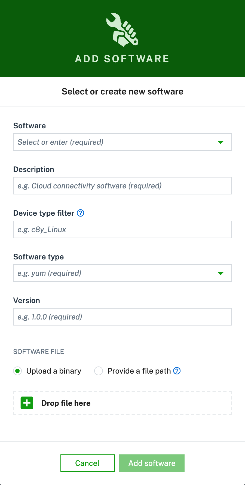
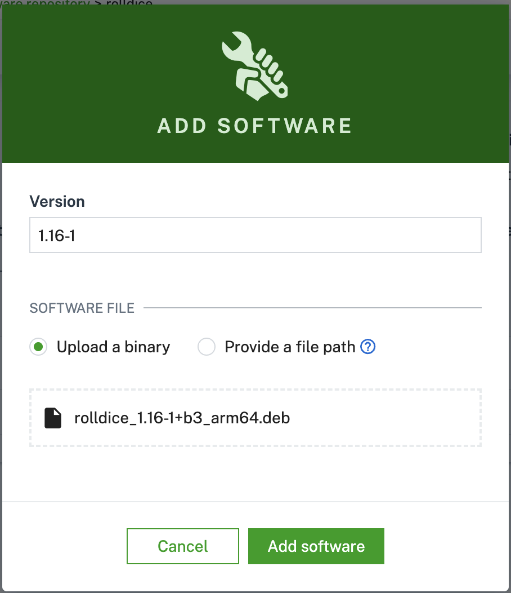
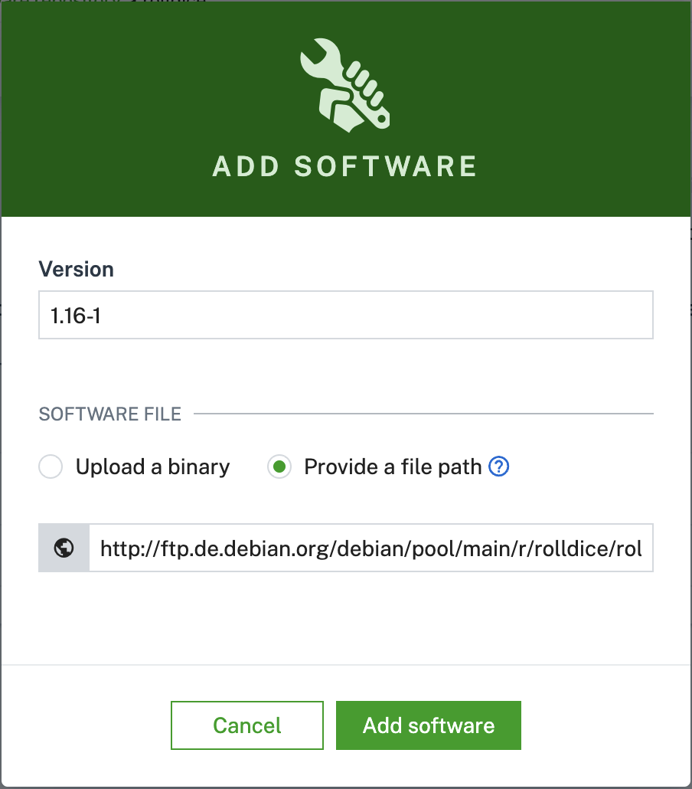

# Manage the software on your devices from Cumulocity cloud

This document describes how to manage the software modules that are installed on a thin-edge device from the
cloud using the **software management** feature of thin-edge.io.

```admonish note
This tutorial shows the Debian based distributions **apt** package manager use-case powered by our official **apt** plugin.
Other package managers can be supported by adding a plugin.
Refer to [this](../extend/write-my-software-management-plugin.md) document on how to write a plugin to support software management for any other software type.
```

```admonish warning
As of now, software management feature is supported only from Cumulocity cloud, which supports only `install` and `delete` as an action of c8y_SoftwareUpdate operation.
```

Three components are required on your devices to enable software management:

1. Software management mapper for Cumulocity cloud acts as a proxy between the cloud and the device.
   This translates the cloud specific message type into device specific type and vice-versa.(Example: Cumulocity smart-rest to/from thin-edge json)
   The messages from cloud will be translated and forwarded to the `tedge-agent` and messages from `tedge-agent` will be translated and sent to cumulocity cloud.
   You can find this process with the name `tedge-mapper c8y` in `ps` once it starts.

2. Software management agent
   The thin-edge software management agent is the one that calls the plugins.
   You can find this process with the name `tedge-agent` in `ps` once it starts.

3. Software management plugin
   Plugins are the interfaces that call the package manager (example: apt/apt-get) to do the software management operations (Install, Remove or update)
   You can find them in /etc/tedge/sm-plugins.
   As of now there is only one (apt) plugin is supported.

## Enable software management feature

Find more information about [how to install and enable software management.](../operate/installation/install_and_enable_software_management.md)

## Managing the device software **repository** on Cumulocity cloud

Managing the software packages installed on the devices from your Cumulocity tenant is a two steps operation.

* Populate the software repository with all the software packages and versions you plan to install.
* Trigger software update operations on the devices, to install specific packages from the repository.

Find more information about [managing the device software](https://cumulocity.com/guides/users-guide/device-management/#managing-device-software)

### Adding new software into the software repository of your tenant

1. In the Software repository page, click Add software at the right of the top menu bar.
2. In the resulting dialog box,
   * to add a new software, enter a name for the software (and confirm it by clicking Create new in the resulting window),
     a description and its version.
   * to add a new version, select the software for which you want to add a new version from the dropdown list in the Software
     field and enter a version of the package. The version is optional and can be set to "latest" or to an empty space (' '), both meaning the latest version will be used.
   > Note: The version field format is `package_version::plugin_type_name`.The plugin type name that is provided here is used to pick
     the appropriate plugin among those installed in /etc/tedge/sm-plugins.

   > Note 2: If the postfix `::plugin_type_name` is left empty, a `default` plugin will be used if defined or if only a single plugin is installed.

3. Optionally, you can define the device type filter when adding a new software.
4. thin-edge.io ships a default plugin supporting `debian` packages from both `apt` repositories as well as remote locations.
   If you prefer to use packages from an `apt` repository, select the **Provide a file path** option and give an **empty space** (' ').
    

   If you would like to use other sources (eg. file uploaded to your cloud or an external source), provide the full url to the file.
    

   If you would like to upload your binaries, select `Upload a binary` option and upload the file to Cumulocity software repository.
    

   > Note: Bear in mind that some external remotes may require additional authentication which is not supported at the moment.
5. Press `Add Software` button.

### Deleting software or software version

One can remove a software module or a specific version of it from the software repository.
Find more information about [how to delete the software or the specific software version](https://cumulocity.com/guides/users-guide/device-management/#deleting-softwares-or-software-versions)

## Managing software on a device

Find more information about [how to manage the software](https://cumulocity.com/guides/users-guide/device-management/#managing-software-on-a-device) on a device.

From the Cumulocity cloud `Software` tab of a device, software can be

* [installed](https://cumulocity.com/guides/users-guide/device-management/#to-install-software-on-a-device)

 > Note: Software profiles are not supported as of now on thin-edge.

* [updated](https://cumulocity.com/guides/users-guide/device-management/#to-update-software-on-a-device)

 > Note: Thin-edge treats install and update same.

* [removed](https://cumulocity.com/guides/users-guide/device-management/#to-delete-software-from-a-device)

```admonish note
Once the above mentioned operation is selected, one should click on **Apply changes** to confirm operation.
```

## Default plugin

When there are multiple plugins installed on the device, one can set one of them as a default plugin.
If there is only one plugin installed on the device, then implicitly this will be the default plugin.

### Usage of `default plugin`

When the default plugin is set, then the software operation does not need to provide an explicit type of the software, then the default will be used.
In Cumulocity, one can then simply provide the package to update without having to annotate the version field with its type.

### Configuring the default plugin

Default plugin can be configured using the thin-edge cli command `tedge`.

For example set `apt` plugin as a `default plugin`

```shell
sudo tedge config set software.plugin.default apt
```

